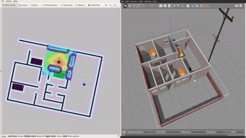

# Project 5: Home Service Robot

## Simulation Setup

### Catkin Workspace:

To program your home service robot, you will need to interface it with different ROS packages. Some of these packages are official ROS packages which offer great tools and others are packages that you’ll create. The goal of this section is to prepare and build your catkin workspace.

### Official ROS packages

Import these packages now and install them in the src directory of your catkin workspace. Be sure to clone the full GitHub directory and not just the package itself.

- gmapping: With the gmapping_demo.launch file, you can easily perform SLAM and build a map of the environment with a robot equipped with laser range finder sensors or RGB-D cameras.

- turtlebot_teleop: With the keyboard_teleop.launch file, you can manually control a robot using keyboard commands.

- turtlebot_rviz_launchers: With the view_navigation.launch file, you can load a preconfigured rviz workspace. You’ll save a lot of time by launching this file, because it will automatically load the robot model, trajectories, and map for you.

- turtlebot_gazebo: With the turtlebot_world.launch you can deploy a turtlebot in a gazebo environment by linking the world file to it.

### Packages and Directories

1. **map**: Inside this directory, stored gazebo world file and the map generated from SLAM.

2. **scripts**: Inside this directory, stored shell scripts.

3. **rvizConfig**: Inside this directory, stored customized rviz configuration files.

4. **pick_objects**: Node that commands the robot to drive to the pickup and drop off zones.

5. **add_markers**: Node that write the model the object with a marker in rviz. This node subscribe to topic of the odometry for calculating the position of the robot.

## Others commands

    mkdir -p /workspace/catkin_ws/src
    cd workspace/catkin_ws/src
    catkin_init_workspace
    catkin_make

    rosdep update
    rosdep -i install turtlebot_gazebo

    // test
    roslaunch turtlebot_gazebo turtlebot_world.launch
    rosrun gmapping slam_gmapping
    roslaunch turtlebot_rviz_launchers view_navigation.launch
    roslaunch turtlebot_teleop keyboard_teleop.launch

    // save map
    rosrun map_server map_saver -f /workspace/catkin_ws/src/map/map.yaml

    rostopic echo /mobile_base/sensors/imu_data

### Docker

- https://github.com/facontidavide/ros-docker-gazebo
- https://github.com/Seanmatthews/ros-docker-gazebo

        sudo apt-get install -y usbutils
        docker build -f "Dockerfile" -t rosudacity:latest .
        bash run_docker.sh

        xhost +
        docker start hsr-run
        docker attach hsr-run

### Doc

- http://wiki.ros.org/
- http://answers.ros.org/
- http://moorerobots.com/blog/post/3
- https://www.youtube.com/watch?v=HIK1KBw-Jn4&list=PLVOHtxHwfT2od1TP-4oWY0Nt6LXsQXOTE&index=16&t=0s
- https://docs.ros.org/en/independent/api/rospkg/html/rospack.html#rospack-find-package